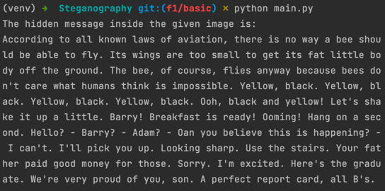
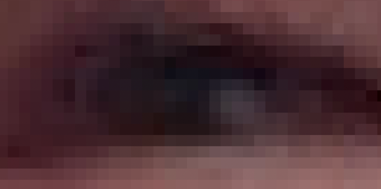
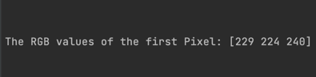
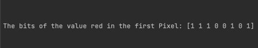

# Steganography
The art of hiding information in plain sight.

## Showcase
You never know what you don't see. This is just a normal image, right? Well, what if I told you that I manage to hide the entire Bee Movie Script in it?

## How it works
You will not find it by zooming in or staring long enough at it. To find the information I have to tell you where I hid it. 

Every image consists of pixels

Every pixel consists of a red a green and a blue value (RGB)

Every value consists of 8 bits

I use the last two bits to store the hidden information. Therefore the values change just a tiny bit. So it is unnoticeable to the human eye. 

# Comparison
## Original Image

## Image with hidden information
